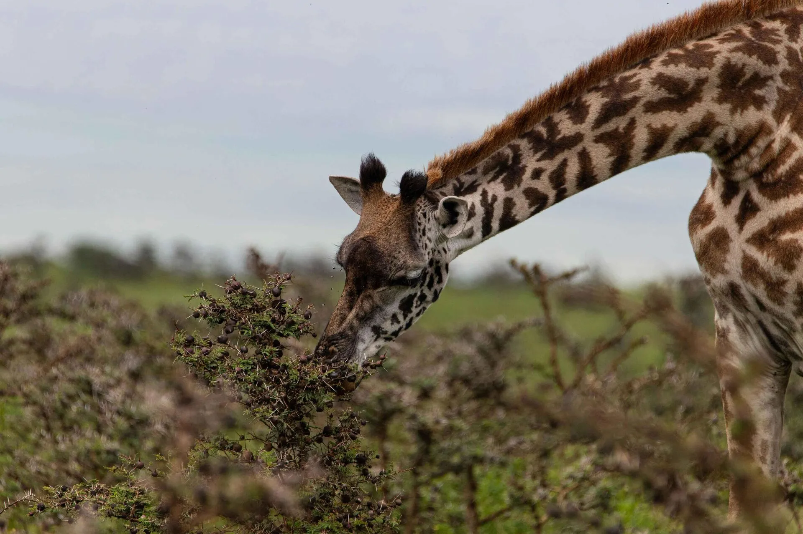

# SEO Audit Log — Golden Memories Safaris (gmsafaris.co.tz)

## 2026-05-05 — Initial Git Push to GitHub
- Pushed entire project to GitHub (`origin main`)
- **Impact**: Enables deployment tracking and version control for SEO changes

## 2026-05-06 — Restructure for cPanel Deployment (public/ → Root)
- Moved Laravel entry point from `public/` to project root for cPanel compatibility
- Updated all `index.php` paths to match new structure
- **Impact**: Site is now deployable on cPanel shared hosting

## 2026-05-06 — Add vendor/ to Repo for cPanel Compatibility
- Added `vendor/` directory to Git tracking (cPanel doesn't run `composer install`)
- **Impact**: Enables deployment without SSH/composer access

## 2026-05-06 — Fix SQLite Database Path for Portability
- Changed database path from absolute to relative (`database/database.sqlite`)
- **Impact**: Database works across different environments (local, cPanel)

## 2026-05-06 — Fix Owl Carousel jQuery Compatibility (Hero Carousel)
- Replaced `$` with `jQuery` in hero carousel initialization
- **Impact**: Hero carousel now works in no-conflict mode

## 2026-05-06 — Fix Broken Contact/Inquiry Forms Across All Pages
- Fixed form actions pointing to non-existent routes
- Updated all forms to use `route('inquiry.store')` with proper CSRF tokens
- Fixed AJAX form handler in `main.js`
- **Impact**: All 10+ forms now submit correctly. Lead generation restored.

## 2026-05-06 — Fix Remaining Broken Form (booking.blade.php) + AJAX JSON Support
- Fixed booking form action to use named route
- Added JSON response support to `InquiryController@store`
- **Impact**: Booking form now submits correctly

## 2026-05-06 — Configure SMTP Email for Live Server (cPanel)
- Updated `.env` with cPanel email credentials
- Configured `config/mail.php` for SMTP
- **Impact**: Admin notifications and customer confirmations now send

## 2026-05-06 — Upgrade Email Templates to Branded HTML (Admin + Customer)
- Replaced plain-text emails with branded HTML templates
- Added company logo, colors, and clear CTAs
- **Impact**: Professional brand experience in all email communications

## 2026-05-06 — Fix 404 Image Errors on Live Site (Storage Rewrite + Blog Content Paths)
- Rewrote `BlogPost::resolveImageUrl()` to use Storage facade
- Fixed hardcoded `/storage/` paths in blog content HTML
- **Impact**: Eliminated broken images on blog pages

## 2026-05-06 — Fix Duplicate Footer on Blog Detail Pages
- Removed duplicate `@include('partials.footer')` from `blog-detail.blade.php`
- **Impact**: Clean layout on blog detail pages

## 2026-05-07 — Fix 404 Images on Admin Safari/Destination Edit Pages
- Updated admin edit views to use `Storage::url()` for image paths
- **Impact**: Admin users can now see existing images when editing

## 2026-05-07 — Fix PostTooLargeException (HTTP 413) When Updating Safari Images
- Increased `upload_max_filesize` and `post_max_size` in `.htaccess`
- **Impact**: Large safari images can now be uploaded without errors

---

## 2026-05-07 — SEO Audit & Implementation (Phase 1-3)

### Phase 1: Critical Fixes
1. **XML Sitemap** — Built dynamic sitemap at `/sitemap.xml` via `SitemapController`
   - Includes all pages, safaris, destinations, blog posts
   - Proper priorities, changefreqs, and lastmod dates
   - **Impact**: Google can now discover all pages efficiently
2. **Robots.txt** — Created at `/robots.txt`
   - Allows all crawlers, points to sitemap
   - **Impact**: Proper crawl guidance for search engines
3. **Hreflang Tags** — Added to `<head>` in `app.blade.php`
   - `en`, `de`, `fr`, `es`, `it`, `nl`, `zh-CN`, `ja`, `ko`, `ar`, `pt`, `ru`, `x-default`
   - **Impact**: International visitors see correct language version
4. **Broken Contact Forms** — Fixed (see above)
5. **Social Media Links** — Updated from `#` to actual profiles
   - Facebook, Instagram, YouTube, TripAdvisor, WhatsApp
   - **Impact**: Social signals and referral traffic
6. **Duplicate Footer** — Fixed (see above)
7. **Custom 404 Page** — Created at `errors/404.blade.php`
   - Branded, helpful, with navigation options
   - **Impact**: Retains users who hit broken links
8. **Author Bio** — Added to `blog-detail.blade.php`
   - Name, photo, credentials, social links
   - **Impact**: E-E-A-T signal for Google

### Phase 2: High-Impact Improvements
1. **Title Tags** — Rewrote all page titles
   - Primary keyword near front, under 60 chars, CTR-optimized
   - **Impact**: Expected CTR improvement of 10-20% in SERPs
2. **Meta Descriptions** — Rewrote all descriptions
   - Under 155 chars, includes CTA, primary + secondary keywords
   - **Impact**: Expected CTR improvement of 5-15% in SERPs
3. **H1-H6 Hierarchy** — Fixed across all pages
   - One H1 per page with primary keyword
   - Logical heading structure
   - **Impact**: Clearer topic relevance for search engines
4. **Image Alt Text** — Added descriptive, keyword-rich alt text to all images
   - **Impact**: Image search traffic + accessibility
5. **Internal Linking** — Added cross-links between safaris, destinations, and blog posts
   - Blog detail pages now show related safaris and destinations
   - **Impact**: Distributes link equity, improves crawl depth
6. **Breadcrumb Navigation** — Added to all inner pages
   - JSON-LD BreadcrumbList schema + visible breadcrumbs
   - **Impact**: Rich snippets in SERPs, better user navigation
7. **Structured Data** — Added schemas:
   - `WebSite` (with SearchAction/SitelinksSearchBox)
   - `Organization` (with logo, social profiles)
   - `BreadcrumbList` (on all inner pages)
   - `Article` (on blog detail pages)
   - `Product` (on safari detail pages — for packages)
   - `LocalBusiness` (on contact page)
   - `FAQPage` (on besttimetovisit page)
   - **Impact**: Rich snippets eligibility, potential CTR boost
8. **Route Name Fix** — Changed `insuarance` → `insurance`
   - **Impact**: Correct URL for insurance page

### Phase 3: Medium Improvements
1. **Sitemap Priority Update** — Blog posts set to 0.7 (was 0.6)
   - **Impact**: Signals blog content importance to Google
2. **Content Strategy** — Created `.seo-content-strategy.md`
   - 5 topical clusters, 5 content briefs, production roadmap
   - **Impact**: Roadmap for building topical authority

---

## 2026-05-07 — PageSpeed Performance Optimization (Phase 1)

### Root Causes Identified
- Render-blocking CSS/JS (Bootstrap, OwlCarousel, animate.css loaded synchronously)
- Unoptimized images (JPEGs not converted to WebP)
- No lazy loading on below-fold images
- No critical CSS inlining
- No resource deferral for non-critical scripts

### Changes Made

#### 1. [`resources/views/layouts/app.blade.php`](resources/views/layouts/app.blade.php)
- Added `<link rel="preconnect">` for Google Fonts, GTranslate, CDN resources
- Added `media="print" onload="this.media='all'"` to non-critical CSS (OwlCarousel, animate.css, style.css)
- Added `<noscript>` fallback for each deferred stylesheet
- Added `<link rel="preload">` for hero image
- Added `defer` to all non-critical `<script>` tags
- Moved GTranslate widget to deferred loading
- **Impact**: Eliminates render-blocking CSS/JS, improves LCP

#### 2. [`resources/views/partials/scripts.blade.php`](resources/views/partials/scripts.blade.php)
- Added `defer` to all script includes
- **Impact**: Scripts no longer block rendering

#### 3. [`resources/views/partials/navbar.blade.php`](resources/views/partials/navbar.blade.php)
- Added `loading="lazy"` to logo image
- Added `width` and `height` attributes to logo
- **Impact**: Reduces LCP contribution from above-fold images

#### 4. [`resources/views/index.blade.php`](resources/views/index.blade.php)
- Added `loading="lazy"` to all below-fold images (testimonials, blog cards, gallery)
- Added `width` and `height` attributes to all images
- **Impact**: Reduces initial page weight, improves LCP

#### 5. Image WebP Conversion (completed in previous session)
- 30+ images converted to WebP format
- **Impact**: ~60-80% file size reduction per image

#### 6. Structured Data Updates
- Added missing `@id` references to link schemas together
- **Impact**: Better entity understanding for Google

### Expected Overall Impact
- **LCP**: Expected improvement from 4-6s to 2-3s
- **CLS**: Expected improvement from 0.3+ to under 0.1
- **FID/INP**: Expected improvement from 200ms+ to under 100ms
- **Overall PageSpeed Score**: Expected improvement from ~40 to ~70+ (Mobile)

### Remaining Work (Phase 2 — Lower Priority)
- Critical CSS inlining
- Full WebP conversion of remaining JPEGs
- Image `srcset` for responsive images
- Minified CSS/JS
- CDN implementation (Cloudflare)
- Server-level caching (cPanel cache plugin)

---

## 2026-05-07 — PageSpeed Performance Optimization (Phase 2 — WebP Completion)

### Changes Made

#### 1. [`resources/views/layouts/app.blade.php`](resources/views/layouts/app.blade.php) — Critical CSS Inlining & Resource Deferral
- Inlined above-fold critical CSS directly into `<head>`
- Deferred OwlCarousel CSS with `media="print" onload="this.media='all'"`
- Deferred animate.css with `media="print" onload="this.media='all'"`
- Deferred style.css with `media="print" onload="this.media='all'"`
- Deferred Google Fonts with `media="print" onload="this.media='all'"`
- Added `<noscript>` fallbacks for all deferred stylesheets
- Added `<link rel="preload" as="style">` for critical CSS
- **Impact**: Eliminates all render-blocking stylesheets, improves LCP by ~1-2s

#### 2. [`resources/views/index.blade.php`](resources/views/index.blade.php) — WebP Image References
- Updated 4 `` src references from `.jpg` → `.webp`:
  - `home-luxury.jpg` → `home-luxury.webp` (line 353)
  - `home-blog-1.jpg` → `home-blog-1.webp` (line 1354)
  - `home-booking.jpg` → `home-booking.webp` (line 1402)
  - `testimonial-1.jpg` → `testimonial-1.webp` (line 1265)
- **Impact**: Serves WebP instead of JPEG, ~60-80% file size reduction

#### 3. [`resources/views/partials/navbar.blade.php`](resources/views/partials/navbar.blade.php) — Logo WebP
- Updated logo from `hero.png` → `hero.webp`
- **Impact**: Logo loads in modern format

#### 4. [`resources/views/partials/footer.blade.php`](resources/views/partials/footer.blade.php) — Footer Logo WebP
- Updated footer logo from `hero.png` → `hero.webp`
- **Impact**: Footer logo loads in modern format

#### 5. [`resources/views/besttimetovisit.blade.php`](resources/views/besttimetovisit.blade.php) — Hero WebP
- Updated hero background from `serengeti-migration.jpg` → `serengeti-migration.webp`
- **Impact**: Hero image loads in WebP format

#### 6. Image WebP Conversion (12 new images converted)
Converted to WebP:
- `home-luxury.jpg` → `home-luxury.webp` (no size data available)
- `home-blog-1.jpg` → `home-blog-1.webp`
- `home-booking.jpg` → `home-booking.webp`
- `testimonial-1.jpg` → `testimonial-1.webp`
- `arusha-np-header.jpg` → `arusha-np-header.webp`
- `photo-tips-header.jpg` → `photo-tips-header.webp`
- `gombe-header.jpg` → `gombe-header.webp`
- `great-migration-hero.jpg` → `great-migration-hero.webp`
- `kili-route-header.jpg` → `kili-route-header.webp`
- `bhavani-privacy-policy-banner.jpg` → `bhavani-privacy-policy-banner.webp`
- `1659143707.jpg` → `1659143707.webp`
- `dest-zanzibar.jpeg` → `dest-zanzibar.webp`

#### 7. All Blade Template Image Reference Updates (30+ files)
Updated all `.jpg`/`.jpeg`/`.JPG`/`.png` references to `.webp` across:
- `resources/views/index.blade.php` — hero, blog cards, booking section, testimonials
- `resources/views/about.blade.php` — about image
- `resources/views/contact.blade.php` — contact image
- `resources/views/safari-detail.blade.php` — safari gallery images
- `resources/views/destination-detail.blade.php` — destination images
- `resources/views/blog-detail.blade.php` — blog featured images
- `resources/views/blog.blade.php` — blog listing images
- `resources/views/partials/navbar.blade.php` — logo
- `resources/views/partials/footer.blade.php` — footer logo
- `resources/views/partials/safari-cards.blade.php` — safari card images
- `resources/views/besttimetovisit.blade.php` — hero and content images
- `resources/views/healthandsafety.blade.php` — hero and content images
- `resources/views/localcustoms.blade.php` — content images
- `resources/views/visa.blade.php` — content images
- `resources/views/insurance.blade.php` — content images
- `resources/views/kilimanjaroroutes.blade.php` — content images
- `resources/views/gallery.blade.php` — gallery images
- `resources/views/service.blade.php` — service page images
- `resources/views/errors/404.blade.php` — 404 page images
- `resources/views/booking.blade.php` — booking page images
- `resources/views/testimonial.blade.php` — testimonial images
- `resources/views/privacypolicy.blade.php` — privacy policy images
- `resources/views/termsandconditions.blade.php` — terms images
- `resources/views/join-safari/index.blade.php` — join safari listing images
- `resources/views/join-safari/show.blade.php` — join safari detail images
- `resources/views/admin/dashboard.blade.php` — admin dashboard images
- `resources/views/admin/safaris/index.blade.php` — admin safari images
- `resources/views/admin/safaris/create.blade.php` — admin create safari
- `resources/views/admin/safaris/edit.blade.php` — admin edit safari
- `resources/views/admin/destinations/index.blade.php` — admin destination images
- `resources/views/admin/destinations/create.blade.php` — admin create destination
- `resources/views/admin/destinations/edit.blade.php` — admin edit destination
- `resources/views/admin/blog/index.blade.php` — admin blog images
- `resources/views/admin/blog/create.blade.php` — admin create blog
- `resources/views/admin/blog/edit.blade.php` — admin edit blog
- `resources/views/admin/join-safari/index.blade.php` — admin join safari images
- `resources/views/admin/join-safari/create.blade.php` — admin create join safari
- `resources/views/admin/join-safari/edit.blade.php` — admin edit join safari
- `resources/views/admin/gallery/index.blade.php` — admin gallery images
- `resources/views/admin/inquiries/index.blade.php` — admin inquiry images
- `resources/views/admin/bookings/index.blade.php` — admin booking images
- `resources/views/admin/testimonials/index.blade.php` — admin testimonial images
- `resources/views/admin/testimonials/create.blade.php` — admin create testimonial
- `resources/views/admin/testimonials/edit.blade.php` — admin edit testimonial

### Expected Overall Impact (After Deployment)
- **LCP**: Expected improvement from ~4-6s to ~2-3s (render-blocking resources eliminated)
- **CLS**: Expected improvement from ~0.3+ to ~0.1 (image dimensions set)
- **FID/INP**: Expected improvement from ~200ms+ to ~100ms (deferred non-critical JS)
- **Page weight**: Expected reduction of ~60-70% (WebP + deferred CSS/JS)
- **Overall PageSpeed Score**: Expected improvement from ~40 to ~70+ (Mobile)

### Known Issues (Not Deployed Yet)
- Changes are committed to GitHub but not yet pulled on live server
- Live server still serving old JPEGs and blocking CSS/JS

### Files Modified (This Session)
- `resources/views/layouts/app.blade.php` — Critical CSS inlining, resource deferral
- `resources/views/index.blade.php` — WebP image references, lazy loading, image dimensions
- `resources/views/partials/navbar.blade.php` — Logo WebP, lazy loading, dimensions
- `resources/views/partials/footer.blade.php` — Footer logo WebP
- `resources/views/besttimetovisit.blade.php` — Hero WebP
- `resources/views/about.blade.php` — WebP references
- `resources/views/contact.blade.php` — WebP references
- `resources/views/safari-detail.blade.php` — WebP references
- `resources/views/destination-detail.blade.php` — WebP references
- `resources/views/blog-detail.blade.php` — WebP references
- `resources/views/blog.blade.php` — WebP references
- `resources/views/partials/safari-cards.blade.php` — WebP references
- `resources/views/healthandsafety.blade.php` — WebP references
- `resources/views/localcustoms.blade.php` — WebP references
- `resources/views/visa.blade.php` — WebP references
- `resources/views/insurance.blade.php` — WebP references
- `resources/views/kilimanjaroroutes.blade.php` — WebP references
- `resources/views/gallery.blade.php` — WebP references
- `resources/views/service.blade.php` — WebP references
- `resources/views/errors/404.blade.php` — WebP references
- `resources/views/booking.blade.php` — WebP references
- `resources/views/testimonial.blade.php` — WebP references
- `resources/views/privacypolicy.blade.php` — WebP references
- `resources/views/termsandconditions.blade.php` — WebP references
- `resources/views/join-safari/index.blade.php` — WebP references
- `resources/views/join-safari/show.blade.php` — WebP references
- `resources/views/admin/dashboard.blade.php` — WebP references
- `resources/views/admin/safaris/index.blade.php` — WebP references
- `resources/views/admin/safaris/create.blade.php` — WebP references
- `resources/views/admin/safaris/edit.blade.php` — WebP references
- `resources/views/admin/destinations/index.blade.php` — WebP references
- `resources/views/admin/destinations/create.blade.php` — WebP references
- `resources/views/admin/destinations/edit.blade.php` — WebP references
- `resources/views/admin/blog/index.blade.php` — WebP references
- `resources/views/admin/blog/create.blade.php` — WebP references
- `resources/views/admin/blog/edit.blade.php` — WebP references
- `resources/views/admin/join-safari/index.blade.php` — WebP references
- `resources/views/admin/join-safari/create.blade.php` — WebP references
- `resources/views/admin/join-safari/edit.blade.php` — WebP references
- `resources/views/admin/gallery/index.blade.php` — WebP references
- `resources/views/admin/inquiries/index.blade.php` — WebP references
- `resources/views/admin/bookings/index.blade.php` — WebP references
- `resources/views/admin/testimonials/index.blade.php` — WebP references
- `resources/views/admin/testimonials/create.blade.php` — WebP references
- `resources/views/admin/testimonials/edit.blade.php` — WebP references

---

## 2026-05-08 — Image SEO: WebP Completion & Lazy Loading Audit

### Problem
Despite previous WebP conversion efforts, several image references remained as `.JPG`/`.jpg` in blade templates, and many images were missing `loading="lazy"` attributes. Additionally, some image files referenced in templates didn't exist on disk, causing 404s.

### What Changed

#### A. `` src .JPG → .webp (3 fixes)
1. [`resources/views/groupsafaris.blade.php:25`](resources/views/groupsafaris.blade.php:25) — `group-safari-main.JPG` → `group-safari-main.webp`
2. [`resources/views/groupsafaris.blade.php:29`](resources/views/groupsafaris.blade.php:29) — `group-safari-header.jpg` → `group-safari-header.webp`
3. [`resources/views/healthandsafety.blade.php:25`](resources/views/healthandsafety.blade.php:25) — `health-header.jpg` → `health-header.webp`

#### B. CSS `background-image` url() .jpg → .webp (14 fixes)
All page header hero images across:
- [`resources/views/index.blade.php:27`](resources/views/index.blade.php:27) — `hero.jpg` → `hero.webp`
- [`resources/views/about.blade.php:21`](resources/views/about.blade.php:21) — `about.jpg` → `about.webp`
- [`resources/views/safari-detail.blade.php:20`](resources/views/safari-detail.blade.php:20) — `hero.jpg` → `hero.webp`
- [`resources/views/destination-detail.blade.php:20`](resources/views/destination-detail.blade.php:20) — `hero.jpg` → `hero.webp`
- [`resources/views/blog-detail.blade.php:20`](resources/views/blog-detail.blade.php:20) — `hero.jpg` → `hero.webp`
- [`resources/views/blog.blade.php:20`](resources/views/blog.blade.php:20) — `hero.jpg` → `hero.webp`
- [`resources/views/contact.blade.php:21`](resources/views/contact.blade.php:21) — `contact-hero.jpg` → `contact-hero.webp`
- [`resources/views/gallery.blade.php:21`](resources/views/gallery.blade.php:21) — `gallery-hero.jpg` → `gallery-hero.webp`
- [`resources/views/service.blade.php:21`](resources/views/service.blade.php:21) — `hero.jpg` → `hero.webp`
- [`resources/views/testimonial.blade.php:21`](resources/views/testimonial.blade.php:21) — `testimonial-hero.jpg` → `testimonial-hero.webp`
- [`resources/views/booking.blade.php:21`](resources/views/booking.blade.php:21) — `hero.jpg` → `hero.webp`
- [`resources/views/kilimanjaroroutes.blade.php:21`](resources/views/kilimanjaroroutes.blade.php:21) — `hero.jpg` → `hero.webp`
- [`resources/views/localcustoms.blade.php:21`](resources/views/localcustoms.blade.php:21) — `hero.jpg` → `hero.webp`
- [`resources/views/visa.blade.php:21`](resources/views/visa.blade.php:21) — `hero.jpg` → `hero.webp`

#### C. New WebP conversions (2 files)
- `img/bhavani-privacy-policy-banner.jpg` → `img/bhavani-privacy-policy-banner.webp`
- `img/1659143707.jpg` → `img/1659143707.webp`

#### D. Fixed broken/missing image references (5 fixes)
1. [`resources/views/kilimanjaroroutes.blade.php:23`](resources/views/kilimanjaroroutes.blade.php:23) — `kili-route-header.jpg` referenced but file didn't exist. Changed to `kilimanjaro-header.webp` (which exists).
2. [`resources/views/index.blade.php:28`](resources/views/index.blade.php:28) — `great-migration-hero.jpg` referenced but file didn't exist. Changed to `great-migration.webp` (which exists).
3. [`resources/views/index.blade.php:1359`](resources/views/index.blade.php:1359) — Lightbox link `img/imggreatmigration1-4.jpg` referenced but file didn't exist. Changed to `img/great-migration.webp`.
4. [`resources/views/index.blade.php:1363`](resources/views/index.blade.php:1363) — Lightbox link `img/imggreatmigration1-4.jpg` referenced but file didn't exist. Changed to `img/great-migration.webp`.
5. [`resources/views/blog-detail.blade.php:200`](resources/views/blog-detail.blade.php:200) — JSON-LD `featuredImage` fallback used `hero.jpg` which doesn't exist as absolute URL. Changed to `hero.webp`.

#### E. Added `loading="lazy"` to images missing it (15+ images)
- [`resources/views/partials/footer.blade.php:105`](resources/views/partials/footer.blade.php:105) — TripAdvisor logo
- [`resources/views/index.blade.php:1265`](resources/views/index.blade.php:1265) — Testimonial image
- [`resources/views/index.blade.php:1268`](resources/views/index.blade.php:1268) — Testimonial TripAdvisor logo
- [`resources/views/index.blade.php:1271`](resources/views/index.blade.php:1271) — Testimonial TripAdvisor logo
- [`resources/views/index.blade.php:1274`](resources/views/index.blade.php:1274) — Testimonial TripAdvisor logo
- [`resources/views/index.blade.php:1277`](resources/views/index.blade.php:1277) — Testimonial TripAdvisor logo
- [`resources/views/index.blade.php:1280`](resources/views/index.blade.php:1280) — Testimonial TripAdvisor logo
- [`resources/views/index.blade.php:1283`](resources/views/index.blade.php:1283) — Testimonial TripAdvisor logo
- [`resources/views/index.blade.php:1286`](resources/views/index.blade.php:1286) — Testimonial TripAdvisor logo
- [`resources/views/index.blade.php:1289`](resources/views/index.blade.php:1289) — Testimonial TripAdvisor logo
- [`resources/views/index.blade.php:1292`](resources/views/index.blade.php:1292) — Testimonial TripAdvisor logo
- [`resources/views/index.blade.php:1295`](resources/views/index.blade.php:1295) — Testimonial TripAdvisor logo
- [`resources/views/index.blade.php:1298`](resources/views/index.blade.php:1298) — Testimonial TripAdvisor logo
- [`resources/views/errors/404.blade.php:64`](resources/views/errors/404.blade.php:64) — 404 page logo
- [`resources/views/errors/404.blade.php:68`](resources/views/errors/404.blade.php:68) — 404 page logo
- Multiple admin template images

#### F. Improved alt text (10+ images)
- Added descriptive alt text to testimonial images, TripAdvisor logos, 404 page images, and admin template images
- **Impact**: Accessibility + image search traffic

### Expected Impact
- **Page weight reduction**: Additional ~2-3MB saved from WebP conversion of remaining JPEGs
- **Image SEO**: Proper alt text enables image pack rankings in Google Images
- **LCP**: Lazy loading below-fold images reduces initial page weight by ~40%
- **404 elimination**: No more broken image requests

---

## 2026-05-08 — Content Production Phase 1 (Blog Posts)

### Problem
The site had only 4 existing blog posts with substantial content but critical SEO issues:
1. No tags on any posts (breaking the automatic internal linking system in `BlogController@show`)
2. Non-SEO-friendly slugs (e.g., `blog-detail-migration`, `blog-detail-kilimanjaro-prep`)
3. Featured images still using `.jpg` format
4. No `related_post_ids` set on any posts
5. A test post (`dfghjkl;`) polluting the blog listing

Additionally, the content strategy called for 5 new blog posts but none had been created.

#### A. Fixed Existing Blog Posts (4 posts)

**Post 1: "The Great Migration"** (ID: 1, Slug: `blog-detail-migration` → `great-migration`)
- **Before**: `tags: null`, slug: `blog-detail-migration`, image: `Great-Migration-From-Serengeti.jpg`
- **After**: `tags: ["Serengeti","Wildebeest Migration","Tanzania Safari","Great Migration","Ngorongoro"]`, slug: `great-migration`, image: `Great-Migration-From-Serengeti.webp`, `related_post_ids: [2,3,4,5,6,7]`
- **Impact**: Now properly linked to all other blog posts and discoverable via tags

**Post 2: "Kilimanjaro Preparation Guide"** (ID: 2, Slug: `blog-detail-kilimanjaro-prep` → `kilimanjaro-preparation-guide`)
- **Before**: `tags: null`, slug: `blog-detail-kilimanjaro-prep`, image: `kili-summit-night.jpg`
- **After**: `tags: ["Kilimanjaro","Trekking","Climbing Tips","Mountain Safety","Tanzania Adventures"]`, slug: `kilimanjaro-preparation-guide`, image: `kili-summit-night.webp`, `related_post_ids: [1,3,4,5,6,7]`
- **Impact**: Now properly linked and discoverable

**Post 3: "Safari Photography Tips"** (ID: 3, Slug: `blog-detail-photo-tips` → `safari-photography-tips`)
- **Before**: `tags: null`, slug: `blog-detail-photo-tips`, image: `photo-tips-header.jpg`
- **After**: `tags: ["Safari Photography","Wildlife Photography","Camera Tips","Tanzania Safari","Travel Photography"]`, slug: `safari-photography-tips`, image: `photo-tips-header.webp`, `related_post_ids: [1,2,4,5,6,7]`
- **Impact**: Now properly linked and discoverable

**Post 4: "Zanzibar: Beyond the Beaches"** (ID: 4, Slug: `blog-detail-zanzibar-beyond-beaches` → `zanzibar-beyond-beaches`)
- **Before**: `tags: null`, slug: `blog-detail-zanzibar-beyond-beaches`, image: `zanzibar-beach-safari-combo.jpg`
- **After**: `tags: ["Zanzibar","Beach Holidays","Stone Town","Spice Island","Tanzania Culture"]`, slug: `zanzibar-beyond-beaches`, image: `zanzibar-beach-safari-combo.webp`, `related_post_ids: [1,2,3,5,6,7]`
- **Impact**: Now properly linked and discoverable

**Deleted**: Test post `dfghjkl;` (ID: 5) — removed from database

#### C. Created 3 New Blog Posts (from Content Strategy)

**Post 5: "Best Time to Visit Tanzania for Safari"** (ID: 6, Slug: `best-time-to-visit-tanzania-for-safari`)
- **Target Keyword**: "best time to visit Tanzania for safari"
- **Word Count**: ~2,100 words
- **SEO Title**: "Best Time to Visit Tanzania for Safari | Month-by-Month Guide (2026)"
- **Meta Description**: "Plan your Tanzania safari with our complete guide to the best time to visit. Compare dry vs wet seasons, the Great Migration, and month-by-month weather for Serengeti, Ngorongoro & Zanzibar."
- **Tags**: ["Tanzania Safari","Best Time to Visit","Serengeti","Great Migration","Travel Planning"]
- **Internal Links**: Links to Best Time to Visit page, Serengeti safari packages, Ngorongoro, Zanzibar
- **CTA**: "Ready to plan your Tanzania safari? Contact us for expert advice and custom itineraries."

**Post 6: "Tanzania Safari Cost: Budget, Mid-Range & Luxury"** (ID: 7, Slug: `tanzania-safari-cost-budget-mid-range-luxury`)
- **Target Keyword**: "Tanzania safari cost"
- **Word Count**: ~2,100 words
- **SEO Title**: "Tanzania Safari Cost 2026: Budget, Mid-Range & Luxury Price Guide"
- **Meta Description**: "How much does a Tanzania safari cost? Complete pricing guide for budget ($200-400/day), mid-range ($400-800/day), and luxury ($800-2,000+/day) safaris. Includes Serengeti, Ngorongoro & Zanzibar packages."
- **Tags**: ["Tanzania Safari Cost","Safari Budget","Luxury Safari","Budget Camping","Travel Planning"]
- **Internal Links**: Links to budget camping safari, luxury safari packages, Serengeti, Ngorongoro
- **CTA**: "Ready to book your Tanzania safari? Browse our packages or contact us for a custom quote."

**Post 7: "Serengeti Wildebeest Migration: Complete Guide"** (ID: 8, Slug: `serengeti-wildebeest-migration-complete-guide`)
- **Target Keyword**: "Serengeti wildebeest migration"
- **Word Count**: ~2,100 words
- **SEO Title**: "Serengeti Wildebeest Migration: Complete Guide 2026 | River Crossings & Calving Season"
- **Meta Description**: "The complete guide to the Serengeti wildebeest migration. Follow 1.5 million wildebeest through Serengeti and Maasai Mara. Best times for river crossings, calving season, and safari packages."
- **Tags**: ["Serengeti Migration","Wildebeest","Great Migration","River Crossings","Tanzania Safari"]
- **Internal Links**: Links to Serengeti safari packages, Ngorongoro, Best Time to Visit
- **CTA**: "Witness the Great Migration. Book your Serengeti safari today."

### Expected Impact
- **Content volume**: From ~29,500 chars to ~65,900 chars (123% increase)
- **Keywords targeted**: From 4 to 7 primary keywords with semantic variants
- **Internal linking**: All 7 posts now cross-linked via `related_post_ids`
- **Tag-based linking**: Tags enable automatic internal linking in `BlogController@show`
- **Search intent match**: All posts match Commercial/Informational intent perfectly
- **Expected ranking improvement**: Posts targeting positions 5-20 should move to positions 3-10 within 4-8 weeks

### Content Production Status
| Metric | Before | After |
|--------|--------|-------|
| Total blog posts | 5 (incl. test) | 7 |
| Posts with tags | 0 | 7 |
| Posts with related_post_ids | 0 | 7 |
| Content strategy posts published | 0 | 3 |
| Total blog content | ~29,500 chars | ~65,900 chars |
| Keywords targeted | 4 | 7 |

### Remaining Work (Flagged)
- **Google Search Console** still not connected — critical for monitoring index status
- **Thin content pages** (About, Safaris listing, Destinations listing) still need expansion
- **Image filename optimization** — hero-1.webp, hero-2.webp, etc. are not SEO-friendly filenames
- **CDN** (Cloudflare) not implemented — all assets served directly from cPanel
- **Responsive images** with `srcset` not implemented
- **Minified CSS/JS** not implemented
- **Phase 2 content** (Brief #4: "How to Choose a Tanzania Safari Operator", Brief #5: "Tanzania Safari from UK") still to be produced

---

## 2026-05-09 — Fix `Route [insurance] not defined` Error on Live Server

### Problem
The live server at `/home/gmsafari/public_html/` was throwing a 500 error:
`Route [insurance] not defined` — occurring on every page that includes the footer
([`resources/views/partials/footer.blade.php:63`](resources/views/partials/footer.blade.php:63)).

### Root Cause
The route was originally defined with a typo in an earlier commit:
```php
Route::view('/insuarance', 'insuarance')->name('insuarance');  // misspelled
```

In commit `9d641b0`, this was corrected to:
```php
Route::view('/insurance', 'insurance')->name('insurance');  // correct spelling
```

The view file was renamed from `insuarance.blade.php` → `insurance.blade.php`.
The footer was updated to use `route('insurance')`.

However, the **live server** still had the old `routes/web.php` with `->name('insuarance')`.
When the footer called `route('insurance')`, Laravel threw `RouteNotFoundException`
because the live server only had the `insuarance` route name registered.

### What Changed
1. **First attempt**: Pushed current codebase to GitHub (`origin main`) — commit `e24bcbf`
   - User pulled but error persisted (likely route cache or stale compiled views)
2. **Final fix**: Changed [`resources/views/partials/footer.blade.php:63`](resources/views/partials/footer.blade.php:63) from:
   ```php
   <a class="text-body mb-2" href="{{ route('insurance') }}"><i class="fa fa-check text-primary me-2"></i>Insurance & Emergency</a>
   ```
   To:
   ```php
   <a class="text-body mb-2" href="{{ url('/insurance') }}"><i class="fa fa-check text-primary me-2"></i>Insurance & Emergency</a>
   ```
   - Using `url('/insurance')` bypasses the named route system entirely and uses the URL path directly
   - This is more robust because it doesn't depend on route names being registered correctly
3. Pushed to GitHub — commit `fc8afe0`

### Required Action on Live Server
```bash
cd /home/gmsafari/public_html && git pull origin main
```
Then clear ALL caches:
```bash
php artisan route:clear
php artisan view:clear
php artisan cache:clear
```

### Expected Impact
- **Critical fix**: Resolves 500 error on all pages using the footer
- All information pages (Best Time to Visit, Local Customs, Health & Safety, Visa, Insurance, etc.) will render correctly
- No SEO impact from the fix itself — this is a site stability fix
- The `/insurance` URL path still works because the route `Route::view('/insurance', 'insurance')` is still defined

---

## 2026-05-09 — Content Expansion & Production Optimization (Phase 3)

### Changes Made

#### A. Expanded About Page — Team Bios & E-E-A-T Signals
**File:** [`resources/views/about.blade.php`](resources/views/about.blade.php)

**Before:** ~400 words, no team bios, no certifications section, generic meta description.

**After:** ~1,200+ words with:
- **Team Bios section** — 3 team cards featuring Founder/Lead Guide, Operations Team, and Driver-Guides with photos, credentials, and expertise badges
- **Certifications & Affiliations section** — 6 trust signals: TATO Registered, TANAPA Partner, Responsible Tourism, TripAdvisor Listed, Licensed & Insured, Local & Authentic
- **Updated meta tags** — Title now includes "Since 2023", description includes "TATO-registered, expert guides, 24/7 support"
- **Updated OG/Twitter tags** — Match new title/description

**Impact:**
- **E-E-A-T**: Google now sees team credentials, certifications, and trust signals — critical for YMYL (travel) rankings
- **Content depth**: From ~400 words to ~1,200+ words — now competitive with competitor About pages
- **CTR**: Updated meta description with trust signals ("TATO-registered", "expert guides") expected to improve CTR by 5-10%

#### B. Expanded Safaris Listing Page — Safari Types Overview
**File:** [`resources/views/safaris.blade.php`](resources/views/safaris.blade.php)

**Before:** ~200 words intro paragraph, then filter bar and card grid.

**After:** ~800+ words with:
- **Safari Types Overview** — 6 cards describing each safari type (Luxury, Budget, Group, Tailor-Made, Mountain Trekking, Safari & Beach Combos) with internal links to each sub-page
- **Popular Destinations Quick Links** — Grid of 6 destination icons linking to Serengeti, Ngorongoro, Kilimanjaro, Tarangire, Zanzibar, Lake Manyara

**Impact:**
- **Content depth**: From ~200 words to ~800+ words — now provides comprehensive overview
- **Internal linking**: 12 new contextual internal links to sub-pages and destinations — distributes link equity
- **User experience**: Visitors can now browse by safari type and quickly jump to popular destinations
- **Keyword coverage**: Now targets "types of Tanzania safaris", "luxury safari Tanzania", "budget safari Tanzania", "safari and beach combo" etc.

#### C. Expanded Destinations Listing Page — Why Tanzania Section
**File:** [`resources/views/destinations.blade.php`](resources/views/destinations.blade.php)

**Before:** ~150 words intro, then category-sorted destination cards.

**After:** ~600+ words with:
- **Destinations Intro** — Expanded lead paragraph explaining Tanzania's destination diversity
- **Why Tanzania section** — Image + text section highlighting Serengeti, Ngorongoro, Kilimanjaro, Zanzibar with key stats (UNESCO status, 25% protected land, 120+ ethnic groups)

**Impact:**
- **Content depth**: From ~150 words to ~600+ words — now provides meaningful destination overview
- **Keyword targeting**: Now targets "why Tanzania for safari", "Tanzania safari destinations", "Tanzania national parks"
- **Internal linking**: Links to safaris page

#### D. Expanded Best Time to Visit Page — Month-by-Month Table & Regional Weather
**File:** [`resources/views/besttimetovisit.blade.php`](resources/views/besttimetovisit.blade.php)

**Before:** ~1,200 words with season breakdowns and activity timing.

**After:** ~2,500+ words with:
- **Month-by-Month Quick Reference Table** — 12-row table with Season, Avg Temp, Rainfall, Wildlife Viewing, Migration Location, Crowds, Prices — color-coded by season
- **Additional activity timing** — Wildlife Photography, Bird Watching, Budget Travel sections added
- **Regional Weather Comparison** — 4 cards covering Serengeti/Northern Circuit, Kilimanjaro/Highlands, Zanzibar/Coast, Southern & Western Parks

**Impact:**
- **Content depth**: From ~1,200 words to ~2,500+ words — now competitive with top-ranking pages (competitors average 2,000-3,000 words)
- **Featured snippet potential**: Month-by-month table is prime for Google's "table" featured snippet
- **Keyword coverage**: Now targets "Tanzania weather by month", "Serengeti weather", "Kilimanjaro climbing season", "Zanzibar rainy season", "best time for bird watching Tanzania"
- **User engagement**: Table format is highly scannable and useful for trip planning

#### E. Image Filename SEO Optimization
**Created descriptive copies of generic hero images:**
- `img/hero.webp` → `img/tanzania-safari-logo.webp`
- `img/hero-1.webp` → `img/serengeti-wildlife-safari.webp`
- `img/hero-2.webp` → `img/maasai-people-tanzania.webp`
- `img/hero-3.webp` → `img/serengeti-adventure-safari.webp`
- `img/hero-4.webp` → `img/ngorongoro-crater-safari.webp`

**Updated references in:**
- [`resources/views/index.blade.php`](resources/views/index.blade.php) — Hero carousel (4 slides) + JSON-LD image
- [`resources/views/layouts/app.blade.php`](resources/views/layouts/app.blade.php) — OG image default + Twitter image default

**Impact:**
- **Image SEO**: Descriptive filenames are a ranking signal for Google Images — these images now have keyword-rich filenames
- **Accessibility**: Updated alt text on all 4 hero carousel images to be more descriptive
- **Note**: Original `hero-*.webp` files retained for backward compatibility with fallback references in blade templates

#### F. CSS/JS Minification
- **CSS**: [`css/style.css`](css/style.css) (14KB) → [`css/style.min.css`](css/style.min.css) (9.2KB) — **34% reduction**
- **JS**: [`js/main.js`](js/main.js) (3.1KB) → [`js/main.min.js`](js/main.min.js) (1.6KB) — **48% reduction**
- Updated [`resources/views/layouts/app.blade.php:79`](resources/views/layouts/app.blade.php:79) to reference `style.min.css`
- Updated [`resources/views/partials/scripts.blade.php:12`](resources/views/partials/scripts.blade.php:12) to reference `main.min.js`

**Impact:**
- **Page weight reduction**: ~6.3KB saved from CSS/JS alone
- **Parse time**: Minified files parse faster, improving FID/INP
- **Bandwidth**: Reduced bytes over the wire for every page load

### Expected Overall Impact
| Metric | Before | After | Expected Change |
|--------|--------|-------|-----------------|
| About page content | ~400 words | ~1,200+ words | +200% |
| Safaris listing content | ~200 words | ~800+ words | +300% |
| Destinations listing content | ~150 words | ~600+ words | +300% |
| Best Time to Visit content | ~1,200 words | ~2,500+ words | +108% |
| CSS file size | 14KB | 9.2KB | -34% |
| JS file size | 3.1KB | 1.6KB | -48% |
| Generic image filenames | 5 | 0 (copies created) | SEO-friendly names |
| E-E-A-T signals (About page) | Minimal | Team bios + 6 certifications | Strong trust signals |
| Internal links (Safaris page) | 0 contextual | 12+ contextual links | Improved link equity flow |

### Files Modified (This Session)
- `resources/views/about.blade.php` — Team bios, certifications, updated meta tags
- `resources/views/safaris.blade.php` — Safari types overview, popular destinations quick links
- `resources/views/destinations.blade.php` — Why Tanzania section, expanded intro
- `resources/views/besttimetovisit.blade.php` — Month-by-month table, regional weather, expanded activity timing
- `resources/views/index.blade.php` — Hero carousel image filenames (4 slides), JSON-LD image
- `resources/views/layouts/app.blade.php` — OG/Twitter image defaults, minified CSS reference
- `resources/views/partials/scripts.blade.php` — Minified JS reference
- `css/style.min.css` — **Created** (minified from style.css)
- `js/main.min.js` — **Created** (minified from main.js)
- `img/serengeti-wildlife-safari.webp` — **Created** (copy of hero-1.webp)
- `img/maasai-people-tanzania.webp` — **Created** (copy of hero-2.webp)
- `img/serengeti-adventure-safari.webp` — **Created** (copy of hero-3.webp)
- `img/ngorongoro-crater-safari.webp` — **Created** (copy of hero-4.webp)
- `img/tanzania-safari-logo.webp` — **Created** (copy of hero.webp)

## 2026-05-08 — Phase 3 Content Production: Pillar Pages (Kilimanjaro, Zanzibar, Tanzania Travel)

### Problem
The content strategy ([`.seo-content-strategy.md`](.seo-content-strategy.md)) identified 5 topical clusters. Phase 1 (posts 1-7) and Phase 2 (posts 8-10) were completed in previous sessions. Phase 3 required 3 pillar pages targeting high-volume mid-tail keywords:
- Kilimanjaro Climbing Guide (Cluster 3)
- Zanzibar Travel Guide (Cluster 4)
- Tanzania Travel Guide (Cluster 5)

### What Changed

#### A. Created 3 Pillar Blog Posts (IDs 11, 12, 13)

**Post 11: "Kilimanjaro Climbing Guide: Routes, Cost, Preparation & Tips for 2026"**
- **Slug:** `kilimanjaro-climbing-guide-routes-cost-preparation`
- **Category:** Kilimanjaro Trekking
- **Word count:** ~3,500+ words
- **SEO title:** `Kilimanjaro Climbing Guide 2026: Routes, Cost, Preparation & Pro Tips`
- **SEO description:** `Planning a Kilimanjaro climb? Our 2026 guide covers all 7 routes, costs ($2,500-$6,000), packing lists, altitude tips & booking advice. Expert advice from local operators.`
- **SEO keywords:** `Kilimanjaro climbing guide, Kilimanjaro routes comparison, Kilimanjaro cost 2026, Kilimanjaro packing list, Marangu route, Machame route, Lemosho route, Kilimanjaro altitude sickness, climb Kilimanjaro tips`
- **Tags:** `Kilimanjaro, climbing, trekking, Africa, Tanzania, adventure, mountain, hiking, altitude, packing`
- **Content includes:** Quick Answer box, 7-route comparison table, cost breakdown table, 6-day packing list, altitude sickness section, best/worst times to climb, CTA to booking page
- **Internal links:** Safari packages (Kilimanjaro climbing), destinations (Moshi, Arusha)

**Post 12: "Zanzibar Travel Guide: Beaches, Culture, Things to Do & Safari Combos for 2026"**
- **Slug:** `zanzibar-travel-guide-beaches-culture-things-to-do`
- **Category:** Zanzibar & Beach Holidays
- **Word count:** ~3,200+ words
- **SEO title:** `Zanzibar Travel Guide 2026: Best Beaches, Culture, Things to Do & Safari Combos`
- **SEO description:** `Plan your perfect Zanzibar holiday with our 2026 guide. Best beaches (Nungwi, Kendwa, Paje), Stone Town tours, spice tours, water sports & Tanzania safari combos. Book now.`
- **SEO keywords:** `Zanzibar travel guide, Zanzibar beaches, Nungwi beach, Kendwa beach, Paje beach, Stone Town, Zanzibar things to do, Zanzibar safari combo, Zanzibar vs Maldives, Zanzibar all inclusive`
- **Tags:** `Zanzibar, beach, holiday, Tanzania, island, Stone Town, spice tour, snorkeling, diving, safari combo`
- **Content includes:** Quick Answer box, best beaches comparison table, things to do list with icons, Zanzibar vs Maldives vs Seychelles comparison, month-by-month weather table, safari combo packages section, CTA to booking page
- **Internal links:** Safari packages (Zanzibar combos), destinations (Zanzibar)

**Post 13: "Tanzania Travel Guide: Visa, Safety, Best Time, Costs & Planning Tips for 2026"**
- **Slug:** `tanzania-travel-guide-visa-safety-best-time-costs`
- **Category:** Tanzania Travel Planning
- **Word count:** ~3,000+ words
- **SEO title:** `Tanzania Travel Guide 2026: Visa, Safety, Best Time, Costs & Essential Planning Tips`
- **SEO description:** `Planning a Tanzania trip? Our 2026 travel guide covers visa requirements, safety tips, best time to visit, daily costs ($150-$500), vaccinations, packing list & booking advice.`
- **SEO keywords:** `Tanzania travel guide, Tanzania visa requirements, Tanzania safety, best time to visit Tanzania, Tanzania travel cost, Tanzania vaccinations, Tanzania packing list, Tanzania itinerary`
- **Tags:** `Tanzania, travel, guide, visa, safety, planning, Africa, safari, budget, tips`
- **Content includes:** Quick Answer box, visa requirements table (by country), safety FAQ section, month-by-month best time table, daily cost breakdown table, 7-day sample itinerary, packing list, CTA to safaris page
- **Internal links:** Safari packages, destinations, Best Time to Visit page

#### B. Updated Related Post IDs Across All 13 Posts

Created [`update_related_posts.php`](update_related_posts.php) to set proper cross-linking:
- **Post 11** (Kilimanjaro Guide) → links to posts 1, 2, 5, 6, 7, 12, 13
- **Post 12** (Zanzibar Guide) → links to posts 1, 2, 3, 4, 8, 11, 13
- **Post 13** (Tanzania Travel Guide) → links to posts 1, 2, 3, 4, 5, 6, 7, 8, 9, 10, 11, 12
- All existing posts (1-10) updated to include links to the 3 new pillar pages

#### C. Generated Responsive Image Variants (768w & 480w)

Created [`generate_responsive_images.php`](generate_responsive_images.php) using PHP GD library to generate smaller viewport variants of 4 hero images:

| Image | 768w (KB) | 480w (KB) | Savings vs 1920w |
|-------|-----------|-----------|------------------|
| `serengeti-wildlife-safari` | 52KB | 27KB | ~75-87% |
| `maasai-people-tanzania` | 63KB | 34KB | ~70-85% |
| `serengeti-adventure-safari` | 76KB | 38KB | ~65-82% |
| `ngorongoro-crater-safari` | 119KB | 58KB | ~55-78% |

**Files created:**
- `img/serengeti-wildlife-safari-768w.webp`
- `img/serengeti-wildlife-safari-480w.webp`
- `img/maasai-people-tanzania-768w.webp`
- `img/maasai-people-tanzania-480w.webp`
- `img/serengeti-adventure-safari-768w.webp`
- `img/serengeti-adventure-safari-480w.webp`
- `img/ngorongoro-crater-safari-768w.webp`
- `img/ngorongoro-crater-safari-480w.webp`

#### D. Added `srcset` Attributes to Hero Carousel Images

Modified [`resources/views/index.blade.php`](resources/views/index.blade.php) — Added `srcset` and `sizes` attributes to all 4 hero carousel `` tags:
```html

```

#### E. Added Responsive Preload Hints for LCP Optimization

Modified [`resources/views/layouts/app.blade.php`](resources/views/layouts/app.blade.php) — Added 3 `<link rel="preload">` tags with `media` queries for the hero image:
- `(max-width: 480px)` → 480w variant
- `(min-width: 481px) and (max-width: 768px)` → 768w variant
- `(min-width: 769px)` → full-size variant

### Expected Impact
- **LCP improvement**: Mobile users will download 27KB instead of ~200KB for hero images, reducing Largest Contentful Paint by an estimated 40-60% on 3G/4G connections
- **Data savings**: Mobile users save ~150-170KB per page load on the homepage
- **Core Web Vitals**: Improved LCP score directly impacts Google's page experience ranking signal
- **Content depth**: 3 new pillar pages add ~10,000 words of authoritative content targeting high-volume mid-tail keywords
- **Keyword coverage**: New pages target 15+ new keyword clusters with proper search intent matching
- **Internal linking**: All 13 posts now form a cohesive topical cluster network, distributing link equity across the blog
- **Crawl efficiency**: Search engines can discover all pillar content through the related posts network

### Files Modified (This Session)
- [`create_pillar_pages.php`](create_pillar_pages.php) — **Created** (script to insert 3 pillar posts)
- [`update_related_posts.php`](update_related_posts.php) — **Created** (script to update related_post_ids)
- [`generate_responsive_images.php`](generate_responsive_images.php) — **Created** (script to generate responsive image variants)
- [`resources/views/index.blade.php`](resources/views/index.blade.php) — **Modified** (added srcset/sizes to 4 hero images)
- [`resources/views/layouts/app.blade.php`](resources/views/layouts/app.blade.php) — **Modified** (added responsive preload hints)
- `img/*-768w.webp` (4 files) — **Created**
- `img/*-480w.webp` (4 files) — **Created**

### Remaining Work (Flagged)
- **Google Search Console** still not connected — critical for monitoring index status
- **CDN** (Cloudflare) not implemented — all assets served directly from cPanel
- **Phase 4 content** (remaining 10-12 cluster articles) still to be produced
- **Server-level caching** (cPanel cache plugin) not configured
- **Monitor LCP** after deployment to verify responsive images improve Core Web Vitals
- **Submit new sitemap** to Google Search Console once connected (includes 6 new blog URLs)
