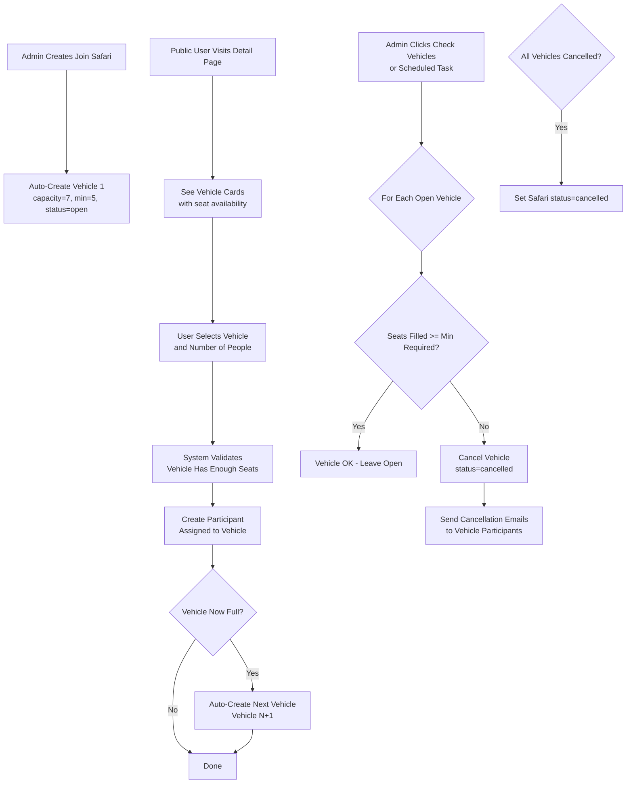

# Join Safari Vehicle-Based System — Implementation Plan

## Overview

Transform the join safari system from a flat "max/min participants" model to a **vehicle-based allocation system**. Each safari jeep carries 7 people. Vehicles auto-expand as they fill, and under-filled vehicles are auto-cancelled with email notifications. No global maximum — unlimited vehicles can be added.

---

## Current System (Before)

```
JoinSafari
├── max_participants (int) — global cap, e.g. 25
├── min_participants (int) — global minimum to run
├── status (open/confirmed/cancelled/completed)
│
JoinSafariParticipant
├── join_safari_id (FK)
├── number_of_people (int)
├── is_confirmed (bool)

spots_filled = sum(number_of_people) of confirmed participants
spots_remaining = max_participants - spots_filled
is_joinable = is_active && status==='open' && spots_remaining > 0
```

## Target System (After)

```
JoinSafari
├── min_participants (int) — per-vehicle minimum (default 5), kept for admin config
├── status (open/confirmed/cancelled/completed) — overall safari status
│   (open = accepting, confirmed = at least 1 vehicle met minimum, cancelled = all vehicles cancelled)
│
JoinSafariVehicle (NEW)
├── join_safari_id (FK)
├── vehicle_number (int) — sequential: 1, 2, 3...
├── capacity (int, default 7)
├── min_required (int, default 5)
├── status (open/confirmed/cancelled)
│
JoinSafariParticipant (MODIFIED)
├── join_safari_id (FK)
├── join_safari_vehicle_id (FK, NEW)
├── number_of_people (int)
├── is_confirmed (bool)

Total spots filled = sum(number_of_people) across ALL participants in ALL vehicles
is_joinable = is_active && safari.status === 'open' (no spots cap — vehicles auto-expand)
```

---

## Business Rules

### Rule 1: Vehicle Capacity
- Each vehicle seats **7 people** (configurable per vehicle, defaults to 7).

### Rule 2: Per-Vehicle Minimum
- A vehicle must have at least **5 confirmed people** to run.
- If a vehicle has < 5 people when the admin triggers the "check vehicles" action (or the departure date passes), that specific vehicle is **cancelled**.
- Only participants in the cancelled vehicle are affected — other vehicles are independent.

### Rule 3: Auto-Expand
- The first vehicle (Vehicle #1) is created automatically when a join safari is created.
- When a vehicle reaches capacity (7/7 seats filled), the **next vehicle** is automatically created with status `open`.
- This happens during the participant signup flow — after a booking fills the last seat, a new vehicle appears.

### Rule 4: Auto-Cancel
- Triggered by: admin clicking "Check Vehicles" button OR a scheduled task (future cron).
- Logic: For each vehicle where `status = 'open'` AND `seats_filled < min_required`:
  - Set vehicle `status` → `cancelled`
  - Send cancellation email to all participants in that vehicle
- If ALL vehicles for a safari are cancelled, set safari `status` → `cancelled`.

### Rule 5: Vehicle Selection During Booking
- Public users see available vehicles with seat counts.
- They can either:
  - Pick a specific vehicle, OR
  - Let the system auto-assign to the first vehicle with enough seats.
- If their party size exceeds one vehicle's remaining seats, they're split across vehicles (with a warning).

---

## Implementation Steps

### Step 1: Create Migration for `join_safari_vehicles`

**New file:** `database/migrations/2026_05_12_000001_create_join_safari_vehicles_table.php`

```php
Schema::create('join_safari_vehicles', function (Blueprint $table) {
    $table->id();
    $table->foreignId('join_safari_id')->constrained()->cascadeOnDelete();
    $table->integer('vehicle_number'); // 1, 2, 3...
    $table->integer('capacity')->default(7);
    $table->integer('min_required')->default(5);
    $table->enum('status', ['open', 'confirmed', 'cancelled'])->default('open');
    $table->timestamps();
    
    $table->unique(['join_safari_id', 'vehicle_number']);
});
```

### Step 2: Add `join_safari_vehicle_id` to Participants

**New migration file:** `database/migrations/2026_05_12_000002_add_vehicle_id_to_join_safari_participants.php`

```php
Schema::table('join_safari_participants', function (Blueprint $table) {
    $table->foreignId('join_safari_vehicle_id')
          ->nullable()
          ->after('join_safari_id')
          ->constrained('join_safari_vehicles')
          ->nullOnDelete();
});
```

### Step 3: Create `JoinSafariVehicle` Model

**New file:** `app/Models/JoinSafariVehicle.php`

Key methods:
- `joinSafari()` — belongsTo
- `participants()` — hasMany
- `confirmedParticipants()` — hasMany where is_confirmed = true
- `getSeatsFilledAttribute()` — sum of number_of_people from confirmed participants
- `getSeatsAvailableAttribute()` — capacity - seats_filled
- `getIsFullAttribute()` — seats_available <= 0
- `getMeetsMinimumAttribute()` — seats_filled >= min_required
- `scopeOpen($query)` — where status = 'open'

### Step 4: Update `JoinSafari` Model

**File:** `app/Models/JoinSafari.php`

Changes:
- Add `vehicles()` — hasMany relationship
- Add `getTotalSpotsFilledAttribute()` — sum of seats_filled across all vehicles
- Remove or deprecate `max_participants` from fillable (keep column for backward compat)
- Update `getIsJoinableAttribute()` — remove spots_remaining check, just check is_active + safari.status === 'open'
- Add `getOpenVehiclesAttribute()` — vehicles where status='open'
- Add `getConfirmedVehiclesAttribute()` — vehicles where status='confirmed'

### Step 5: Update `JoinSafariParticipant` Model

**File:** `app/Models/JoinSafariParticipant.php`

Changes:
- Add `vehicle()` — belongsTo relationship
- Add `join_safari_vehicle_id` to fillable

### Step 6: Update Admin `JoinSafariController` — Create/Store

**File:** `app/Http/Controllers/Admin/JoinSafariController.php`

Changes to `store()`:
- Remove `max_participants` validation
- After creating the `JoinSafari`, auto-create Vehicle #1:
  ```php
  $joinSafari->vehicles()->create([
      'vehicle_number' => 1,
      'capacity' => 7,
      'min_required' => $validated['min_participants'] ?? 5,
      'status' => 'open',
  ]);
  ```

### Step 7: Update Admin Views — Remove Max Participants

**Files:**
- `resources/views/admin/join-safaris/create.blade.php` — remove max_participants field, rename min to "Min People Per Vehicle"
- `resources/views/admin/join-safaris/edit.blade.php` — same changes
- `resources/views/admin/join-safaris/index.blade.php` — update "Min / Max" column to show "Vehicles" column

### Step 8: Update Admin Show Page — Add Vehicle View

**File:** `resources/views/admin/join-safaris/show.blade.php`

Add a "Vehicles" section showing:
- Vehicle #, Capacity, Seats Filled, Seats Available, Status, Participants list per vehicle
- "Check Vehicles" button → triggers auto-cancel logic
- Status badges per vehicle

### Step 9: Add Admin Routes & Methods for Vehicle Management

**File:** `routes/admin.php`

New routes:
```php
Route::post('/join-safaris/{joinSafari}/check-vehicles', [JoinSafariController::class, 'checkVehicles'])
    ->name('join-safaris.check-vehicles');
```

**File:** `app/Http/Controllers/Admin/JoinSafariController.php`

New methods:
- `checkVehicles(JoinSafari $joinSafari)` — runs auto-cancel logic
- `cancelVehicle(JoinSafariVehicle $vehicle)` — cancels a single vehicle + emails participants

### Step 10: Update Public `JoinSafariController` — Join Method

**File:** `app/Http/Controllers/JoinSafariController.php`

Changes to `join()`:
- Remove `$joinSafari->spots_remaining` check (no global cap)
- Add vehicle allocation logic:
  1. If user specifies a `vehicle_id`, validate it's open and has enough seats
  2. Otherwise, auto-assign to first open vehicle with enough seats
  3. If party size > one vehicle's available seats, split across vehicles
- After creating participant, check if the vehicle is now full → auto-create next vehicle
- Validate `number_of_people` against specific vehicle's available seats

### Step 11: Update Public `JoinSafariController` — Show Method

**File:** `app/Http/Controllers/JoinSafariController.php`

Changes to `show()`:
- Eager load `vehicles` with `confirmedParticipants`
- Pass vehicles to the view

### Step 12: Update Public Join Safari Detail View

**File:** `resources/views/join-safari/show.blade.php`

Changes:
- Replace the spots progress bar with a vehicle-based display
- Show vehicle cards:
  ```
  ┌─────────────────────────────┐
  │  Vehicle #1  🟢 Open        │
  │  ████████░░  5/7 seats      │
  │  2 seats available          │
  │  Min 5 people to confirm    │
  │  [Join This Vehicle]        │
  └─────────────────────────────┘
  ┌─────────────────────────────┐
  │  Vehicle #2  🟡 Open        │
  │  ████░░░░░░  2/7 seats      │
  │  5 seats available          │
  │  Min 5 people to confirm    │
  │  Needs 3 more to confirm    │
  │  [Join This Vehicle]        │
  └─────────────────────────────┘
  ```
- Add vehicle selection to the join form (radio buttons or auto-select)
- Show vehicle assignment info before submitting
- Update `is_joinable` checks — remove spots_remaining, just check status

### Step 13: Update Public Join Safari Listing View

**File:** `resources/views/join-safari/index.blade.php`

Changes to safari cards:
- Replace "Spots: X filled / Y left" with vehicle-based summary
- Show "X vehicles | Y total seats available"
- Update progress bar to show overall fill rate

### Step 14: Create Email Templates for Auto-Cancel

**New files:**
- `resources/views/emails/join-safari/vehicle-cancelled.blade.php`
  - Subject: "Your safari vehicle has been cancelled — [Safari Title]"
  - Body: Explains that vehicle didn't meet minimum, offers alternatives

Update `app/Mail/` or send directly via `Mail::to()` in the controller.

### Step 15: Seed Existing Data

**Create script:** `database/seeders/JoinSafariVehicleSeeder.php` (or run inline)

For the existing join safari (ID: 7):
- Create Vehicle #1 with capacity=7, min_required=5, status='open'
- Assign existing participants to Vehicle #1

### Step 16: Update `spots_filled` / `spots_remaining` Accessors

**File:** `app/Models/JoinSafari.php`

The `getSpotsFilledAttribute()` and `getSpotsRemainingAttribute()` accessors are used in many views. Update them to aggregate across vehicles rather than using `max_participants`:

```php
public function getSpotsFilledAttribute()
{
    return $this->vehicles->sum(fn($v) => $v->seats_filled);
}

public function getSpotsRemainingAttribute()
{
    return $this->vehicles
        ->where('status', 'open')
        ->sum(fn($v) => $v->seats_available);
}
```

---

## Auto-Cancel Logic (Detailed)

```
function checkVehicles(JoinSafari $safari):
    foreach $safari->vehicles where status === 'open':
        if vehicle.seats_filled < vehicle.min_required:
            vehicle.status = 'cancelled'
            vehicle.save()
            
            foreach vehicle.confirmedParticipants:
                send CancellationEmail(participant)
    
    // Check if ALL vehicles are cancelled
    if $safari->vehicles()->where('status', '!=', 'cancelled')->count() === 0:
        $safari->status = 'cancelled'
        $safari->save()
    
    // Check if any vehicle meets minimum → safari can be confirmed
    if $safari->vehicles()->where('status', 'open')->where('meets_minimum', true)->exists():
        // Optionally auto-confirm vehicles that meet minimum
        // Or leave for admin to manually confirm
```

---

## Auto-Expand Logic (Detailed)

```
function join(Request $request, $slug):
    $safari = find by slug
    $requestedPeople = (int) $request->number_of_people
    $selectedVehicleId = $request->vehicle_id  // optional
    
    if $selectedVehicleId:
        $vehicle = find vehicle, validate it's open
        if $vehicle->seats_available < $requestedPeople:
            error: "Only X seats available in Vehicle #N"
    else:
        // Auto-assign to first vehicle with enough seats
        $vehicle = first open vehicle where seats_available >= $requestedPeople
        if no such vehicle:
            // Split needed - pick first vehicle, warn user about split
            // OR: just assign to first open vehicle with any availability
    
    // Create participant
    $participant = JoinSafariParticipant::create([
        ...validated,
        'join_safari_vehicle_id' => $vehicle->id,
    ]);
    
    // Check if vehicle just filled → auto-create next
    if $vehicle->fresh()->is_full:
        $nextNumber = $safari->vehicles()->max('vehicle_number') + 1;
        $safari->vehicles()->create([
            'vehicle_number' => $nextNumber,
            'capacity' => 7,
            'min_required' => $safari->min_participants ?? 5,
            'status' => 'open',
        ]);
```

---

## Files to Create

| # | File | Purpose |
|---|------|---------|
| 1 | `database/migrations/2026_05_12_000001_create_join_safari_vehicles_table.php` | New vehicles table |
| 2 | `database/migrations/2026_05_12_000002_add_vehicle_id_to_join_safari_participants.php` | FK on participants |
| 3 | `app/Models/JoinSafariVehicle.php` | Vehicle model |
| 4 | `resources/views/emails/join-safari/vehicle-cancelled.blade.php` | Cancellation email |

## Files to Modify

| # | File | Changes |
|---|------|---------|
| 1 | `app/Models/JoinSafari.php` | Add vehicles() relation, update accessors, remove max_participants from logic |
| 2 | `app/Models/JoinSafariParticipant.php` | Add vehicle() relation, add vehicle_id to fillable |
| 3 | `app/Http/Controllers/Admin/JoinSafariController.php` | Auto-create vehicle on store, add checkVehicles/cancelVehicle methods, update show() |
| 4 | `app/Http/Controllers/JoinSafariController.php` | Vehicle-aware join() logic, pass vehicles to show() |
| 5 | `resources/views/admin/join-safaris/create.blade.php` | Remove max_participants, rename min_participants label |
| 6 | `resources/views/admin/join-safaris/edit.blade.php` | Same as create |
| 7 | `resources/views/admin/join-safaris/index.blade.php` | Update columns (Min/Max → Vehicles) |
| 8 | `resources/views/admin/join-safaris/show.blade.php` | Add vehicle section, check vehicle button |
| 9 | `resources/views/join-safari/show.blade.php` | Vehicle cards, vehicle selection in form |
| 10 | `resources/views/join-safari/index.blade.php` | Vehicle summary in cards |
| 11 | `routes/admin.php` | Add check-vehicles route |

---

## Data Flow Diagram



---

## Risks & Considerations

1. **Backward compatibility**: Existing views reference `$joinSafari->max_participants`, `$joinSafari->spots_remaining`, `$joinSafari->spots_filled`. The accessors will be updated to aggregate across vehicles, so these should continue working.

2. **Existing data**: The current join safari (ID: 7) has `max_participants=25, min_participants=6, spots_filled=0`. After migration, a seed script must create Vehicle #1 with `min_required=5` (new default) and assign any existing participants to it.

3. **Email delivery**: Auto-cancel emails require working SMTP (already configured). Test on staging first.

4. **SQLite compatibility**: The project uses SQLite. All migrations must use SQLite-compatible syntax (no `enum` in SQLite — use string column with check constraint or just string validation in the model).

---

## Resolved Design Decisions

| Decision | Answer |
|----------|--------|
| **Party splitting** | Split automatically with a warning. If a user books more people than fit in one vehicle, they get split across vehicles (e.g., 3 in Vehicle #1, 5 in Vehicle #2) with a clear notice before submitting. |
| **Auto-confirm vehicles** | Auto-confirm. When a vehicle hits 5+ confirmed people, its status is automatically set to `confirmed`. No admin action needed. |
| **Auto-cancel trigger** | Admin-only manual trigger via "Check Vehicles" button. No automatic scheduled task. |
| **min_required default** | 5 for all vehicles. Existing safari (ID: 7) will use 5, not its old `min_participants=6`. |
